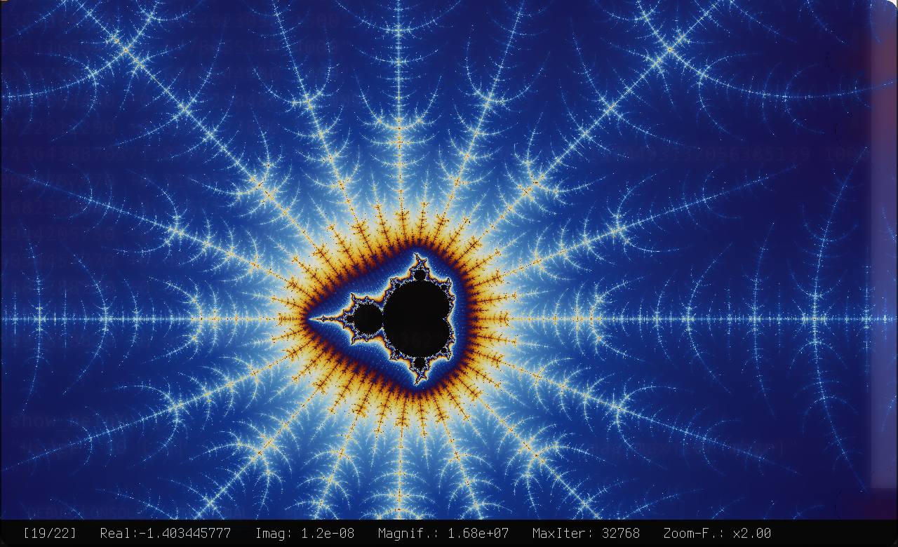

# Mandelbrot Visualization

This project provides a simple visualization of the [Mandelbrot set](https://en.wikipedia.org/wiki/Mandelbrot_set) with interactive move and zoom functionality, as well as predefined "regions of interest" to explore notable areas. Additionally, a small [Bash script](create_gif.sh) allows for the creation of animated sequences.

<div style="display: flex; justify-content: center; gap: 10px;">
    <kbd></kbd>
    <kbd></kbd>
</div>

## Build

To build the project, you’ll need the `cmake` and `sfml` packages. For Arch-based distributions, you can install them with:

```sh
pacman -S cmake sfml
```

Once the dependencies are installed, build the project as follows:

```sh
mkdir build && cd build
cmake .. && make
```

## Interactive Mode with [SFML](https://www.sfml-dev.org/)

You can start the Mandelbrot set visualization in interactive mode in two ways:

```sh
# Start with default parameters (width: 845, height: 480)
./bin/Mandelbrot

# Start with a custom screen size
./bin/Mandelbrot 1280 720
```

In interactive mode, you can use the following keys to navigate, zoom, and explore different regions:

Key | Function
--- | ---
<kbd>W</kbd> | Increase magnification
<kbd>S</kbd> | Decrease magnification
<kbd>R</kbd> | Reset magnification to 1.0
<kbd>A</kbd> | Decrease maximum number of iterations
<kbd>D</kbd> | Increase maximum number of iterations
<kbd>H</kbd> | Move view left
<kbd>J</kbd> | Move view down
<kbd>K</kbd> | Move view up
<kbd>L</kbd> | Move view right
<kbd>Q</kbd> | Go to the previous region of interest
<kbd>E</kbd> | Go to the next region of interest
<kbd>ESC</kbd> | Exit the program

## Generating Animations

To generate animations, use the provided [create_gif.sh](create_gif.sh) script. This script captures frames as the zoom or movement progresses and compiles them into a GIF, visualizing a zoom-in or pan across the Mandelbrot set.

<p><div style="display: flex; justify-content: center; gap: 10px;">
    <kbd></kbd>
    <kbd></kbd>
</div>
<div style="display: flex; justify-content: center; gap: 10px;">
    <kbd></kbd>
    <kbd></kbd>
</div></p>

Ensure you have `ImageMagick` installed for GIF creation. On Arch-based systems, install it with:

```sh
pacman -S imagemagick
```

To see all available options, run:

```sh
./create_gif.sh -h
```

Here are some examples of how the script can be used:

```sh
# Create an animation for the 10th predefined region (with 
# default parameters)
./create_gif.sh -r 10

# Create an animation with custom settings (resolution, center, 
# iterations, and magnification)
./create_gif.sh -c 1280 720 -1.9401573530 +0.0000000000 16000 600000
```

In the script itself, you can adjust additional parameters such as the magnification gain and frame time between each step. These values cannot be modified via command-line arguments but can be fine-tuned within the script to control the animation’s speed and depth.
